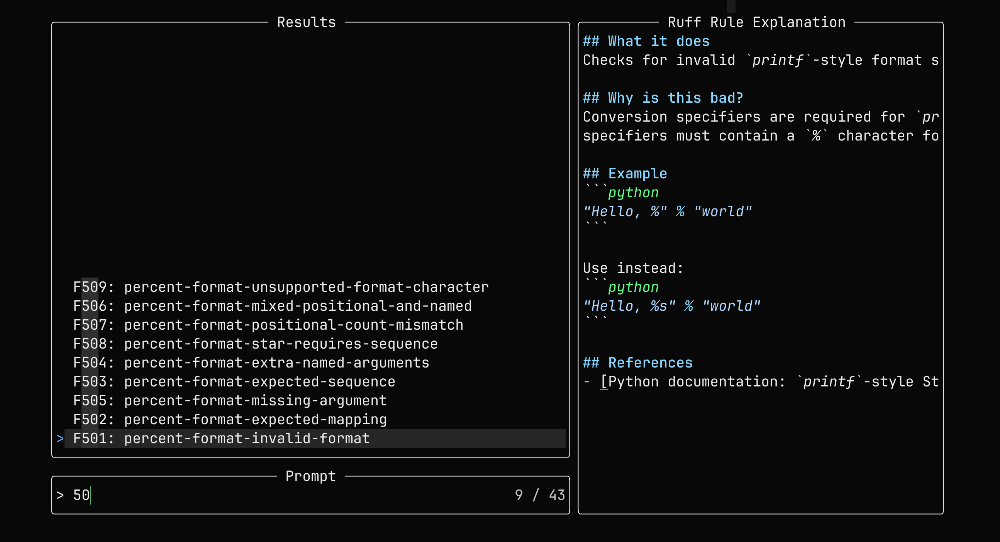

# ruff-rules.nvim

This provides buffers and a telescope picker for ruff rules:



## Dependencies

This relies on `uv` in order to get a version of ruff.

## Installation

Using your favorite plugin manager. For example, with `lazy.nvim`:

```lua
{
  "williambdean/ruff-rules.nvim",
  dependencies = {
    "nvim-telescope/telescope.nvim"
    "nvim-lua/plenary.nvim"
  },
}
```

## Usage

The plugin provides the following command:

```lua
:RuffRules <optional rule prefix or exact rule>
```

Examples:

```lua
--- Picker for all rules
:RuffRules

--- Picker for flake8 rules
:RuffRules F

--- Picker for a specific rule
:RuffRules F401
```
